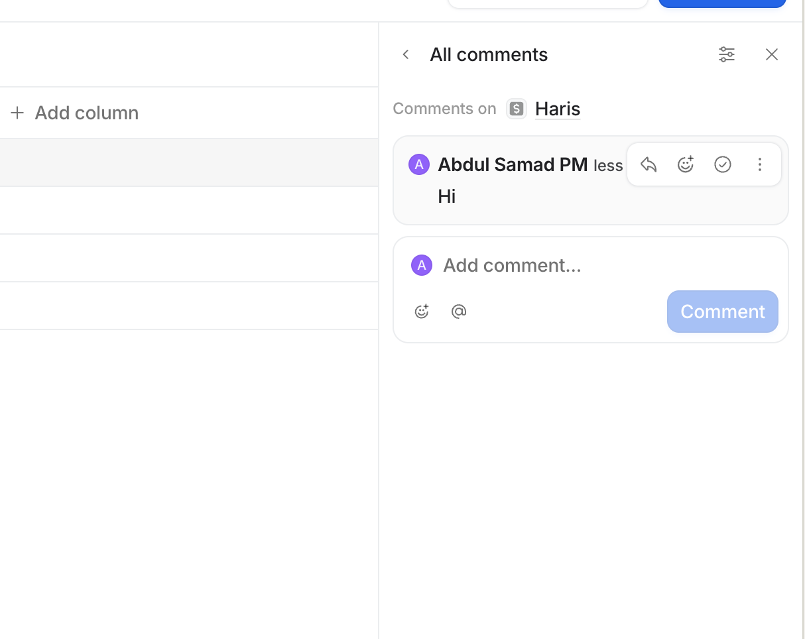

# Feature Documentation

---

# 1. Motor New

**Core Flows**

*These flows must work end-to-end:*

User clicks 'Add Enquiry' → fills form: Client Name (text), Source/Agent Name (dropdown of employees - This dropdown also allows searching for an agent), Chassis No (text), Remarks (text area, shown in right-side panel) → saves entry → appears in table

User adjusts revisions on any table row using +/- counter in the 'Revisions' column — this is ONLY editable while status is 'New Enquiry'. Once status changes to Converted or Lost, the +/- buttons are disabled/hidden and the revision count becomes read-only

User changes status to 'Converted' or 'Lost' → revision verification popup appears: if revisions > 0 → show count and ask to confirm ('Verify your revision count: X revisions recorded. Confirm to proceed.') with Confirm/Cancel; if revisions = 0 → ask yes/no 'Did you make any revisions for this enquiry?' → if Yes: prompt to enter revision count then save; if No: proceed with 0 revisions and save → TAT is calculated as time from entry creation to status change → Accuracy is calculated at this point only using: 100 × (0.9 ^ revisions)

Accuracy is ONLY calculated and displayed for entries with status Converted or Lost. For New Enquiry status, accuracy cell shows '—' or blank

### **Admin View**

User selects an agent from a filter/toggle at the top → KPI cards update to show per-agent stats: Total Enquiries, Enquiries Revised (entries where revisions > 0), Enquiries Converted, Lost, Avg TAT, Avg Accuracy

User toggles back to 'All Users' view → KPI cards revert to global aggregate stats

## **Technical Requirements**

### Entities:

Sales Agent — { name: string }

Enquiry — { clientName: string, agentId: ref(Sales Agent), chassisNo: string, remarks: string, status: enum(new enquiry|converted|lost), revisions: number (default 0), createdAt: datetime, statusChangedAt: datetime }

### Calculated fields:

TAT = statusChangedAt - createdAt (shown in hours or days, only when status = converted/lost)

Accuracy = 100 × (0.9 ^ revisions) — ONLY calculated and shown when status = converted or lost. Show '—' for new enquiry status.

Revisions +/- counter: editable ONLY when status = 'new'. Locked (read-only) once status = converted or lost.

### KPI cards:

- **Total Enquiries** = total count of entries in filtered set

- **Enquiries Revised** = count of entries where revisions > 0 (in filtered set)

- **Converted** = count where status = converted

- **Lost** = count where status = lost

- **Avg TAT** = average TAT of converted/lost entries

- **Avg Accuracy** = average accuracy of converted/lost entries only

## Revision verification modal logic (triggered when status changes to converted or lost):

If revisions > 0: show "Verify your revision count: X revisions recorded. Confirm to proceed." with Confirm/Cancel

If revisions = 0: show "Did you make any revisions for this enquiry?" Yes / No

- Yes → show number input to enter revision count, then save with that count

- No → proceed and save with 0 revisions

## **Other features**

- **Search**: text input above table, filters rows by clientName (case-insensitive partial match) in real-time.
- **Filters**
    - Enquiries
        - User View: by agent, by status, by date
        - Admin view: by agent, by user, by status, by date
    - Track View
        - Admin View: by users
    - Dashboard
        - User View: by date
        - Admin View: by date, users

### **Status Options**

- New enquiry
- Converted
- Lost

### **Input from user**

1. Client Name → Text input
2. Source Name → Pull data from Sales KPI users (All users with access to the Sales KPI module should appear in this list) with search option on dropdown menu
3. Chassis No → Text input
4. Remarks → Text area (Show on side Panel) (Clicking directly on the raw field should open or display the note in the side panel)
    
    
    

1. No. of Quotes Compared → Numbers

### Show these columns on Table

- ID → Just number start with 1
- Client Name
- Agent Name
- Added by
- Chassis No
- Status
- Revisions
- TAT
- Accuracy
- No. of Quotes Compared
- Added on

### Math Break Down

Enquiry Accuracy = 100 × (decay ^ revisions)

Agent Accuracy = Σ(Enquiry Accuracies) / No. of Enquiries

Decay = 0.9

# 2. Motor Renewal

---

### Points to note

- Assigned clients
    - Similar to Sales KPI Assigned Clients
    - The same popup also needs to be implemented here
- Revision verification modal logic - Same as Motor New
- Calculated fields - Same as Motor New

### **Input from user**

1. Client Name → Text input
2. Source Name → Pull data from Sales KPI users (All users with access to the Sales KPI module should appear in this list) with search option on dropdown menu
3. Chassis No → Text input
4. Remarks → Text area (Show on side Panel) (Clicking directly on the raw field should open or display the note in the side panel)
5. No. of Quotes Compared → Numbers

### **Status Options**

- New
- Retained
- Lost

### Show these columns on Table

- ID → Just number start with 1
- Client Name
- Agent Name
- Added by
- Chassis No
- Status
- Revisions
- TAT
- Accuracy
- No. of Quotes Compared
- Added on

### Accuracy Math Break Down

Each Enquiry Accuracy = 100 × (decay ^ revisions)

Agent Accuracy = Σ(Enquiry Accuracies) / No. of Enquiries

Decay = 0.9

## **Other features**

- **Search**: text input above table, filters rows by clientName (case-insensitive partial match) in real-time.
- **Filters**
    - Enquiries
        - User View: by agent, by status, by date
        - Admin view: by agent, by user, by status, by date
    - Track View
        - Admin View: by users
    - Dashboard
        - User View: by date
        - Admin View: by date, users
- Place only the Client Retention UI in the same place.
    
    
    

### KPI cards:

- **Total Enquiries Assigned** = total count of entries in filtered set

- **Enquiries Revised** = count of entries where revisions > 0 (in filtered set)

- **Retained** = count where status = retained

- **Lost** = count where status = lost

- **Avg TAT** = average TAT of converted/lost entries

- **Avg Accuracy** = average accuracy of converted/lost entries only

- **Total Enquiries Assigned / Retained** = Total count of entries / Count where status = retainedc